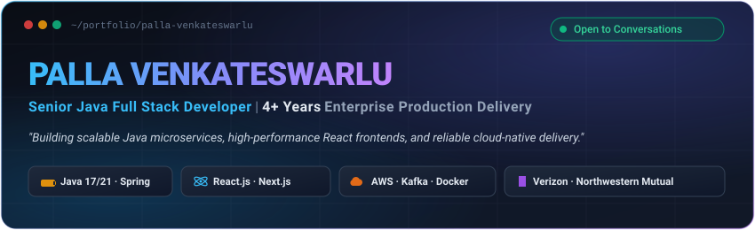
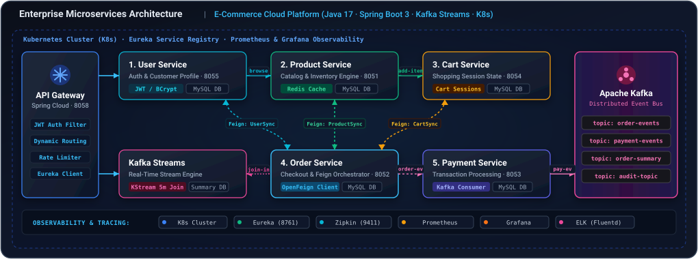
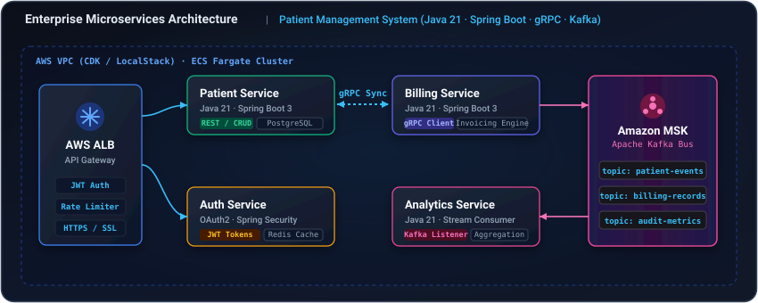

  

 

<!-- Recruiter Quick Summary Metric Dashboard -->

| ⏱️ Total Experience | 🏢 Enterprise Clients | ☕ Core Backend | ⚛️ Frontend & UI | ☁️ Cloud & DevOps |
| :---: | :---: | :---: | :---: | :---: |
| **4+ Years** Hands-on Delivery | **Verizon · N. Mutual** Enterprise Scale | **Java 17/21 · Spring Boot** gRPC · Apache Kafka | **React.js · Next.js 14** TypeScript · MFE | **AWS ECS · Docker** CDK · Jenkins · CI/CD |

---

### 💼 Career & Enterprise Impact

| Role & Enterprise Client | Company & Period | Core Stack | Measurable Engineering Impact |
| :--- | :--- | :--- | :--- |
| **Senior Software Engineer** Client: **Verizon** *(Velocity Studio)* | **Innova Solutions** `Apr 2026 – Present` 📍 *Hyderabad* | `React` `Module Federation` `SSE Streaming` `Auth Flow` `TypeScript` | • Shipped 3 MFE microfrontends (`host`, `studio`, `canvas`) • Built real-time LLM token streaming (SSE) & silent 401 recovery • Delivered feature-flagged document canvas & Google Drive uploads • Engineered recents history with pagination, pin, rename & delete |
| **Software Engineer** Client: **Northwestern Mutual** | **HCL Technologies** `Nov 2021 – Feb 2025` 📍 *Chennai* | `Java 17` `Spring Boot` `OAuth2 / JWT` `React` `Jenkins` `ELK Stack` | • Engineered microservices with multi-DB persistence (MySQL, Mongo, Oracle) • Automated CI/CD pipelines, **shrinking release cycles by 50%** • Boosted system reliability by **20%** via ELK distributed monitoring • Sped up feature delivery cycles by **40%** in fast Agile sprints |
| **Full Stack Intern** | **Techciti Technologies** `May 2020 – Jul 2020` 📍 *Bengaluru* | `REST APIs` `Payments` `E-Commerce` `Agile` | • Built an e-commerce storefront with REST APIs & payment gateways |

---

### 🛠️ Tech Stack At A Glance

| Domain | Technologies & Frameworks |
| :--- | :--- |
| **☕ Languages** |     |
| **🚀 Backend & APIs** |       |
| **⚛️ Frontend** |       |
| **☁️ Cloud & DevOps** | -232F3E?style=flat-square&logo=amazonwebservices&logoColor=white)     |
| **💾 Data & Cache** |       |
| **🧪 Testing & Quality** |       |
| **🤖 AI Acceleration** |    |

---

### 🏛️ Flagship Architecture & Projects

#### 1. 🛒 E-Commerce Cloud Platform
**Enterprise Event-Driven Microservices Architecture**  
*Java 17 · Spring Boot 3 · Apache Kafka · Kafka Streams · Spring Cloud · Kubernetes · Docker*

 

 

| ☕ Core Stack | 🔄 Event Streaming | 🌐 Service Mesh & Gateway | 💾 Data & Caching | 📊 Telemetry & Observability |
| :---: | :---: | :---: | :---: | :---: |
| **Java 17** Spring Boot 3.x | **Apache Kafka** Kafka Streams Join | **Spring Cloud** Gateway · Eureka · Feign | **MySQL & Redis** Database-Per-Service | **Prometheus · Grafana** Zipkin Tracing · ELK Stack |

##### 🏛️ System Architecture

A distributed, resilient e-commerce ecosystem architected with **decoupled microservices**, **synchronous OpenFeign RPCs** for low-latency queries, **asynchronous event choreographies** via **Apache Kafka**, stateful stream processing with **Kafka Streams**, and end-to-end container orchestration on **Kubernetes (K8s)**.

  

 

##### ⚙️ Microservices Ecosystem Matrix

| Microservice | Port | Core Role & Responsibilities | Inter-Service Protocol | Data Store & Cache |
| :--- | :---: | :--- | :--- | :--- |
| **`user-service`** | `8055` | **Step 1:** User identity, registration, password hashing (BCrypt), customer validation | REST / OpenFeign Target | MySQL (`user_db`) |
| **`product-service`** | `8051` | **Step 2:** Product catalog CRUD, stock management, high-throughput cached inventory reads | REST / OpenFeign Target | MySQL + Redis Cache |
| **`cart-service`** | `8054` | **Step 3:** Shopping cart sessions, active item mutations, automated cart clearing on checkout | REST / OpenFeign Target | MySQL (`cart_db`) |
| **`order-service`** | `8052` | **Step 4:** Order placement, checkout coordination, Feign orchestrator, event publication | OpenFeign Client + Kafka Producer | MySQL (`order_db`) |
| **`payment-service`** | `8053` | **Step 5:** Payment capture & verification, transaction ledger, payment lifecycle events | Kafka Listener + Kafka Producer | MySQL (`payment_db`) |
| **`apigateway-service`** | `8058` | Single ingress point, JWT authentication filtering, dynamic path routing, rate limiting | Spring Cloud Gateway | In-memory / Actuator |
| **`eureka-server`** | `8761` | Central service discovery registry, client heartbeat health-checks, dynamic load balancing | Netflix Eureka | Dynamic Registry |
| **`shipping-service`** | `8056` | Fulfillment dispatch, courier carrier assignments, package tracking updates | REST API | MySQL (`shipping_db`) |
| **`favourite-service`** | `8057` | User wishlist management, product bookmarking, customer preferences | REST API | MySQL (`favourite_db`) |
| **`kafka-analytics-service-streams`** | `—` | Stateful stream processing joining `order-events` and `payment-events` in real time | Kafka Streams (`StreamsBuilder`) | KStream State Store |
| **`audit-service`** | `8059` | Immutable event audit trail, regulatory compliance logging across all microservices | Kafka Consumer (`audit-topic`) | Audit Log Store |

 

---

#### 2. 🏥 Patient Management Microservices System
*Distributed System · Java 21 · Spring Boot 3 · gRPC · Kafka · AWS CDK · LocalStack*

  

 

| Component | Technical Implementation |
| :--- | :--- |
| **4 Microservices** | `Patient`, `Billing`, `Auth`, and `Analytics` services independently containerized via Docker |
| **gRPC Sync Calls** | Ultra-low latency point-to-point synchronous RPCs with Protobuf between Patient and Billing |
| **Kafka Event Bus** | Asynchronous event streaming (`patient-created`, `billing-records`, `audit-metrics`) |
| **Cloud IaC** | Automated AWS infrastructure via **AWS CDK + LocalStack** (VPC, RDS PostgreSQL, MSK, ALB, ECS Fargate) |
| **Test Coverage** | Comprehensive suites with **JUnit 5**, **REST-Assured**, OpenAPI/Swagger validation & ELK logging |

---

### 🌐 Live Demos & Production Deployments

| Project | Stack | Highlights | Demo Link |
| :--- | :--- | :--- | :---: |
| 🛒 **E-Commerce Cloud Platform** | `Java 17` `Spring Boot` `Kafka` `K8s` | 11 microservices, Kafka Streams join, OpenFeign, K8s | [**Source Code ↗**](https://github.com/palla023/Ecom_Spring_Project) |
| 🛍️ **Eshop Multi-Role Storefront** | `Next.js` `TypeScript` `RBAC` | Multi-role portals, protected routes, cart & orders | [**Live Demo ↗**](https://eshop-ai-seven.vercel.app/) |
| 📚 **Library Management System** | `React` `Node` `MongoDB` | Role-based portal for Admins, Librarians & Users | [**Live Demo ↗**](https://lm-mern.onrender.com/) |
| 👨‍💻 **Developers Hub** | `MERN` `Redux` `REST` | Full developer network with social profiles & posts | [**Live Demo ↗**](https://developershub-mern.onrender.com/) |
| 💬 **Real-Time Social App** | `React` `Socket.io` `Node` | Instant messaging, live presence & social feeds | [**Live Demo ↗**](https://socisleith-messenger.onrender.com/) |
| 📝 **Blog Publishing Platform** | `React` `Node` `MongoDB` | Author dashboards, rich creation & public discovery | [**Live Demo ↗**](https://mern-blog-app-chm0.onrender.com/) |
| 🍽️ **Restaurant Table Booking** | `React` `JavaScript` `CSS3` | Table reservations, filtered menus & table ordering | [**Live Demo ↗**](https://resproj.netlify.app/) |
| ⚡ **Firebase Cloud Records CRUD** | `React` `Firebase` `Firestore` | Real-time cloud sync, instant record mutations | [**Live Demo ↗**](https://reactfirebasecrudfunc.netlify.app/) |

---

### 📊 GitHub Productivity Stats

---

### 🎓 Education & Award

| Degree / Certification | Institution | Timeline |
| :--- | :--- | :---: |
| **B.Tech, Computer Science Engineering** | Bharath Institute of Higher Education and Research | `2017 – 2021` |
| **Board of Intermediate Education (MPC)** | Narayana Junior College | `2015 – 2017` |
| 🏆 **Client Recognition Award** | Client recognition for outstanding performance & elevated client satisfaction | `Enterprise Honors` |

---

### 📬 Direct Recruiter Connect

 

© 2026 Palla Venkateswarlu · Hyderabad, India

